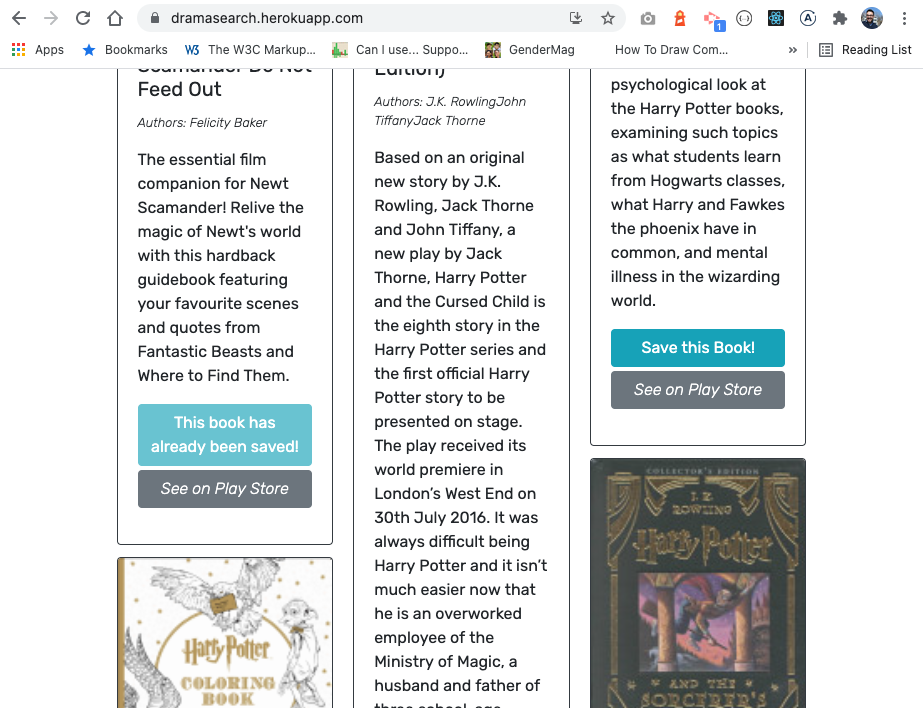

# MERN app with Google API
[](https://www.gnu.org/licenses/gpl-3.0)

Refactpred a functioning Google books API search engine built with RESTful API into GraphQL API with Apollo Server. 

See the app live here: https://dramasearch.herokuapp.com/

## Table of Contents
- [MERN app with Google API](#mern-app-with-google-api)
  - [Table of Contents](#table-of-contents)
  - [Installation](#installation)
  - [Code](#code)
    - [GraphQL Updates (`/server` side)](#graphql-updates-server-side)
      - [Schemas](#schemas)
        - [typeDefs](#typedefs)
        - [Resolvers](#resolvers)
    - [REACT update (`/client` side)](#react-update-client-side)
      - [mutations.js](#mutationsjs)
      - [queries.js](#queriesjs)
      - [googleAPI.js - Tecnically not needed, I could have left that on the API.js file, but it really doesn't belong there, because aren't using API.js anymore...](#googleapijs---tecnically-not-needed-i-could-have-left-that-on-the-apijs-file-but-it-really-doesnt-belong-there-because-arent-using-apijs-anymore)
    - [Replacing the API calls with GraphQL](#replacing-the-api-calls-with-graphql)
      - [Login and Signup](#login-and-signup)
      - [Saving a book](#saving-a-book)
      - [Retrieving saved books](#retrieving-saved-books)
  - [See it in action](#see-it-in-action)
  - [Questions](#questions)

## Installation

In order to run this app locally, please do a git pull or clone from here: 
https://github.com/acevezl/bookazon-gql

Once downloaded run the following command on the root directory:

```
npm install
```
This command will install the necessary components for the app based on the root package file:

```
{
  "name": "googlebooks-app",
  "version": "1.0.0",
  "description": "",
  "main": "server/server.js",
  "scripts": {
    "start": "cd server && npm start",
    "start:prod": "cd server && npm start",
    "start:dev": "concurrently \"cd server && npm run watch\" \"cd client && npm start\"",
    "develop": "concurrently \"cd server && npm run watch\" \"cd client && npm start\"",
    "install": "cd server && npm i && cd ../client && npm i",
    "build": "cd client && npm run build",
    "heroku-postbuild": "cd client && npm run build"
  },
  "keywords": [],
  "author": "Luis Arnaut",
  "license": "ISC",
  "devDependencies": {
    "concurrently": "^5.1.0"
  },
  "dependencies": {
    "@apollo/react-hooks": "^4.0.0",
    "if-env": "^1.0.4"
  }
}
```


## Code
In order to switch from a RESTful API to Graph QL I made two big changes: **(1)**created GraphQL schemas on the `/server` side with type definitions and resolvers, which effectively replace the API endpoints. And **(2)** created queries and mutations on the `/client` side to call these resolvers and use the data on the front end.

### GraphQL Updates (`/server` side)

#### Schemas
Under `/server` created a folder called `/server/schemas` and added the type definitions and resolvers files:

##### typeDefs
* User: To define the user document, which will hold user information along with saved books.

```
type User {
    _id: ID
    username: String
    email: String
    password: String
    savedBooks: [bookSchema]
  }
```
  
* Book: To define the saved book subdocument, not a real model, but still a type needed to store the books under the User document.

```
type bookSchema {
    _id: ID
    bookId: String
    title: String
    authors: [String]
    description: String
    image: String
    link: String
}
```

* Auth: Used for token and authentication

```
type Auth {
    token: ID!
    user: User
}
```

* Queries: These define two main queries: (me) to retrieve the logged user data, and (user) to retrieve any user data (the latter is not used in this codebase, but isn't it pretty!?!?). `Note:` Operations that yield static results are queries, while modifications to data are *mutations* (Keep reading my dear reader...).
  
```
  type Query {
    me: User,
    user: User
  }
```

* Mutations: These are operations that involve changing the state of data. For example, logging in changes the state of the Auth Token, adding a user (Signup) changes the data of the user (new user now...), same for adding a book and removing a book - The user document is modified, or rather *mutated*. 
  
```
  type Mutation {
    login(email: String!, password: String!): Auth
    addUser(username: String!, email: String!, password: String!): Auth
    addBook(bookId: String!, title:String!, authors: [String]!, description: String, image: String, link: String): User,
    removeBook(bookId: String!): User
  }
```

##### Resolvers
These are the magic bits of code that make the queries and mutations work. Here we'll design what operations occur on each `query` and `mutation`. 

* Query resolvers: These are operations that retrieve the data from the database. `queries` are used for reading operations (while `mutations` are used for creating, updating, and deleting).
```
Query: {
    me: async (parent, args, context) => {
      if (context.user) {
        const userData = await User.findOne({ _id: context.user._id })
        .select('-__v -password')
        return userData;
      }
      throw new AuthenticationError('Not logged in');
    },
    user: async (parent, args, context) => {
      console.log(context.user);
      return User.findOne({ _id: context.user._id })
        .select('-__v -password');
      
    }, 
  },
```

* Mutations: These are oprations that create, update, and delete data from the database. Basically operations where the data changes (mutates).

Adding a user (on Sign up):
```
Mutation: {
    addUser: async (parent, args) => {
      const user = await User.create(args);
      const token = signToken(user);

      return { token, user };
    },
    [...]
```

Logging in:
```
    login: async (parent, { email, password }) => {
      const user = await User.findOne({ email });

      if (!user) {
        throw new AuthenticationError('Incorrect credentials');
      }

      const correctPw = await user.isCorrectPassword(password);

      if (!correctPw) {
        throw new AuthenticationError('Incorrect credentials');
      }

      const token = signToken(user);
      return { token, user };
    },
    [...]
```

Saving a book (adding it to the User document, as a subdocument):
```
    addBook: async (parent, {bookId, authors, description, image, title, link}, context) => {
      if (context.user) {
        
        const updatedUser = await User.findByIdAndUpdate(
          { _id: context.user._id },
          { $addToSet: { savedBooks: {
            bookId, authors, description, image, title, link
          } } },
          { new: true, runValidators: true }
        );
        console.log(updatedUser);
        return updatedUser;
      }

      throw new AuthenticationError('You need to be logged in!');
    },
    [...]
```

Deleting a book (updating the User document, removing the book from the savedBooks array):
```
    removeBook: async (parent, {bookId}, context) => {
      
      if (context.user) {
        const updatedUser = await User.findByIdAndUpdate(
          { _id: context.user._id },
          { $pull: { savedBooks: { bookId } } },
          { new: true, runValidators: true }
        )
        console.log(updatedUser);
        return updatedUser;
      }
    }
  } // <-- This last  bracket is from the Mutation opened above
```

### REACT update (`/client` side)
On the client side, I've added a three new files under /utils:

#### mutations.js
All the calls to the mutations created on the `resolvers.js` file on the `/server` are here. `Note` that each mutation will be imported into the REACT files and replace the API calls:

```
import gql from 'graphql-tag';

export const LOGIN_USER = gql`
  mutation login($email: String!, $password: String!) {
    login(email: $email, password: $password) {
      token
      user {
        _id
        username
        email
      }
    }
  }
`;

export const ADD_USER = gql`
  mutation addUser($username: String!, $email: String!, $password: String!) {
    addUser(username: $username, email: $email, password: $password) {
      token
      user {
        _id
        username
      }
    }
  }
`;

export const ADD_BOOK = gql`
  mutation addBook($bookId: String!, $title: String!, $authors:[String]!, $description: String, $image: String, $link: String) {
    addBook(bookId: $bookId, title: $title, authors: $authors, description: $description, image: $image, link: $link) {  
      _id
      username
      email
      savedBooks {
        _id
        bookId
        authors
        title      
        description
        image
        link
      }
    }
  }
`;

export const REMOVE_BOOK = gql`
  mutation removeBook($bookId: String!) {
    removeBook(bookId: $bookId) {
      _id
      username
      email
      savedBooks {
        _id
        bookId
        authors
        title      
        description
        image
        link
      }
    }
  }
`;
```

#### queries.js
Similar to the `mutations` file, now we're declaring all the callouts to the queries defined on the `/server` side. In this case, only one {Query: me} to retrieve the data of the logged user.

```
export const QUERY_ME = gql`
  {
    me {
      _id
      username
      email
      savedBooks {
        _id
        bookId
        authors
        title      
        description
        image
        link
      }
    }
  }
`;
```

#### googleAPI.js - Tecnically not needed, I could have left that on the API.js file, but it really doesn't belong there, because aren't using API.js anymore...

```
// make a search to google books api
// https://www.googleapis.com/books/v1/volumes?q=harry+potter
export const searchGoogleBooks = (query) => {
    return fetch(`https://www.googleapis.com/books/v1/volumes?q=${query}`);
  };
```

### Replacing the API calls with GraphQL

Now that we've created the hooks for the data using GraphQL, it is simply matter of identifying the API code and replacing it with GraphQL code. Here are a few examples:

#### Login and Signup
The app has a `handleFormSubmit` method that is invoked when users enter their e-mail and password to login on the `LoginForm.js` component. The API code is calling the methods defined on API.js. 

`SignupForm.js` functions in a very similar way - but on this README I'm only describing the Login updates (See the code for the full experience):

```
try {
    const response = await loginUser(userFormData);

    if (!response.ok) {
    throw new Error('something went wrong!');
    }

    const { token, user } = await response.json();
    console.log(user);
    Auth.login(token);
} catch (err) {
    console.error(err);
    setShowAlert(true);
}
```

The code above is now replaced with the code below:

```
try {
    const { data } = await login({
    variables: { ...userFormData }
    });

    Auth.login(data.login.token);
} catch (e) {
    setShowAlert(true);
}
```

Since we have defined the hooks for GraphQL along with the resolvers and type definitions, the code on the front end is much lighter (ain't it pretty!?!?!). The key here is to ensure we import the appropriate hooks at the top of the Login component:

```
import { useMutation } from '@apollo/react-hooks';
import { LOGIN_USER } from '../utils/mutations';
```

#### Saving a book
The API code to save a book goes as follows:

```
try {
    // const response = await saveBook(bookToSave, token);
    
    if (!response.ok) {
    throw new Error('something went wrong!');
    }

    // if book successfully saves to user's account, save book id to state
    setSavedBookIds([...savedBookIds, bookToSave.bookId]);
} catch (err) {
    console.error(err);
}
```

And it was replaced by the following code (now on GraphQL):

```
try {
    await addBook({
    variables: { ...bookToSave }
    });
    setSavedBookIds([...savedBookIds, bookToSave.bookId]);
} catch (e) {
    console.error(e);
}
```
Updated imports (note we're fully deprecating API.js):
```
// import { saveBook, searchGoogleBooks } from '../utils/API';
import { searchGoogleBooks } from '../utils/googleAPI'
import { saveBookIds, getSavedBookIds } from '../utils/localStorage';
```
Again - the simplicity of the code comes from the use of GraphQL hooks on the client side, and resolvers and type dfinitions on the server side.

#### Retrieving saved books
This is the most complex part of the update - and it is just because we're dealing with queries and mutations on the same component:

Updated imports (again, fully deprecating API.js):
```
// import React, { useState, useEffect } from 'react';
import React from 'react';
[...]

import { Redirect } from 'react-router-dom';
import { useQuery, useMutation } from '@apollo/react-hooks';
import { QUERY_ME } from '../utils/queries';
import { REMOVE_BOOK } from '../utils/mutations';

//import { getMe, deleteBook } from '../utils/API';
```

Deprecate `useEffect` completely - since we're now using GraphQL mutations, there's no need to check when data changed through useEffect. The mutation will update by its own (via the hooks we created).

In other words, all this code:
```
  // use this to determine if `useEffect()` hook needs to run again
  // const userDataLength = Object.keys(userData).length;
 
  // useEffect(() => {
  //   const getUserData = async () => {
  //     try {
  //       const token = Auth.loggedIn() ? Auth.getToken() : null;

  //       if (!token) {
  //         return false;
  //       }

  //       const response = await getMe(token);

  //       if (!response.ok) {
  //         throw new Error('something went wrong!');
  //       }

  //       const user = await response.json();
  //       setUserData(user);
  //     } catch (err) {
  //       console.error(err);
  //     }
  //   };

  //   getUserData();
  // }, [userDataLength]);
```

Is now:

```
const { loading, data:userData } = useQuery(QUERY_ME);
```

Here's how we would delete a book using REST API:

```
try {
    const response = await deleteBook(bookId, token);

    if (!response.ok) {
    throw new Error('something went wrong!');
    }

    const updatedUser = await response.json();
    setUserData(updatedUser);
    // upon success, remove book's id from localStorage
    removeBookId(bookId);
} catch (err) {
    console.error(err);
}
```

Replace the code above with the code below, and here's how we now do it with GraphQL

```
try {
    await removeBook({
    variables: { bookId }
    });
    removeBookId(bookId);
} catch (e) {
    console.error(e);
}
```

## See it in action

Access the app here: https://dramasearch.herokuapp.com/ and search for any term:


And the functionality is `EXACTLY THE SAME` you can save a book: 



And see it under your collection of books:


## Questions
E-mail me: <lou.arnaut@gmail.com>
Checkout my Github profile: [acevezl](https://github.com/acevezl)
